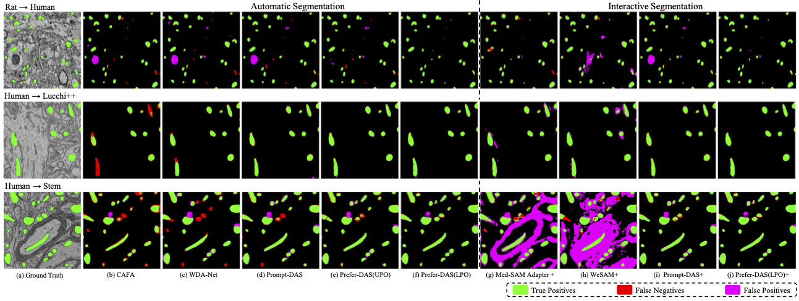

# Prefer_DAS

The official code repository for the paper:

Prefer-DAS: Learning from Local Preferences and Sparse Prompts for Domain Adaptive Segmentation of Electron Microscopy

A visualization of local human preferences:


Visual comparison in EM image segmentation tasks:


Visual comparison in histopathological image segmentation tasks:


## Datasets:
Download MitoEM dataset（MitoEM-Human and MitoEM-Rat）: https://mitoem.grand-challenge.org/.

Lucchi++: https://sites.google.com/view/connectomics/.

Stem: https://huggingface.co/datasets/pytc/MitoEM2.0.
## Download Checkpoint
Click the links below to download the [Prefer-DAS (LPO)](https://drive.google.com/drive/folders/1P7Xy-FTUeNw696NOqVQ8N_Jd0T__Jwyv?usp=sharing) checkpoint for the R → H、H → R、H → Lucchi++ and H → Stem.

## Training
Todo
<!-- To train the model(s) in the paper, run this command:

```train
python train.py --input-data <path_to_data> --alpha 10 --beta 20
```

>📋  Describe how to train the models, with example commands on how to train the models in your paper, including the full training procedure and appropriate hyperparameters. -->

## Evaluation
To evaluate my model on R/H, run:

```eval
python Evaluation.py
```